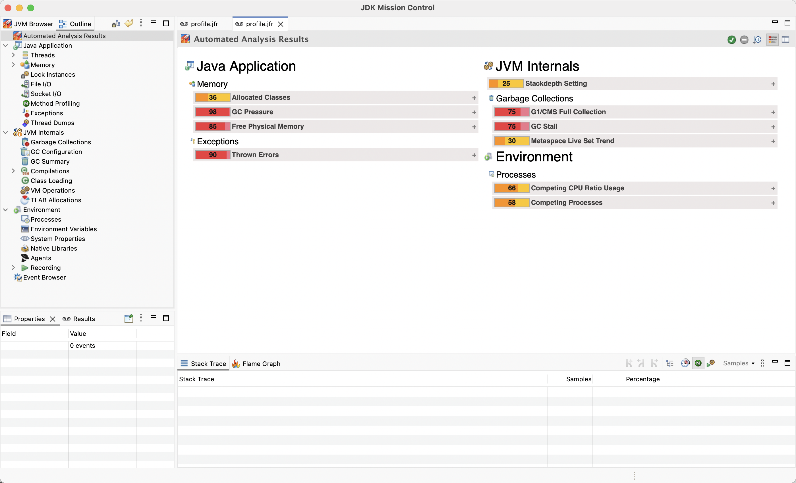
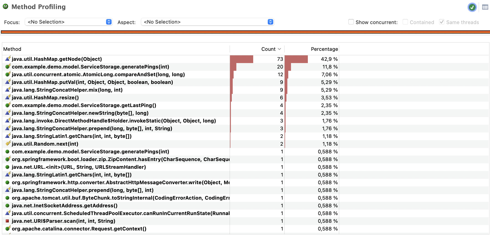
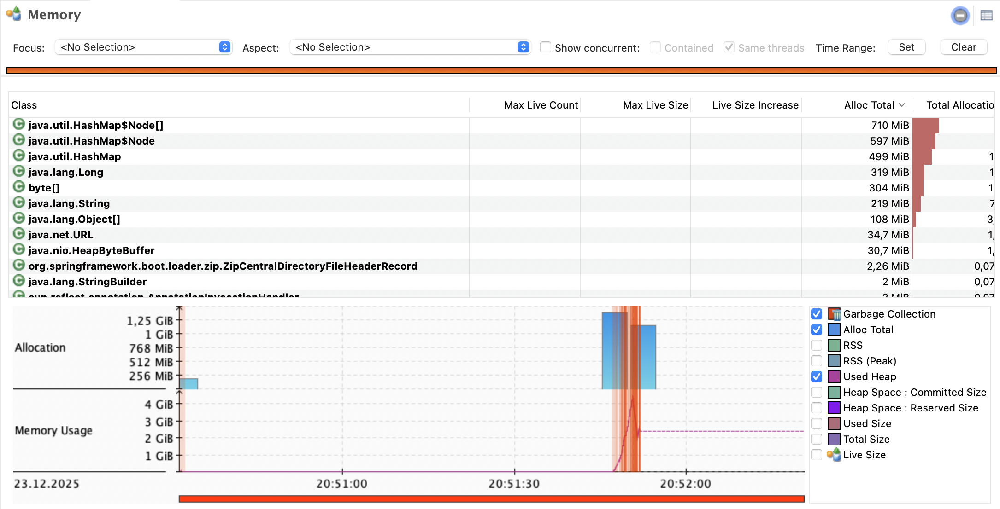
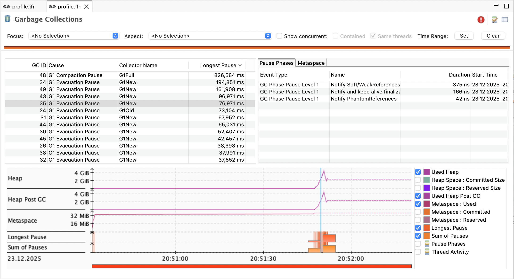
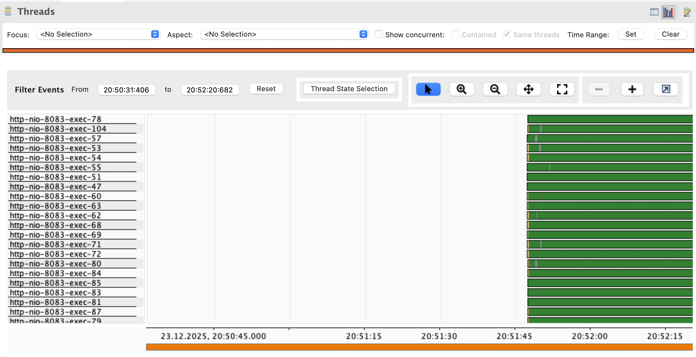
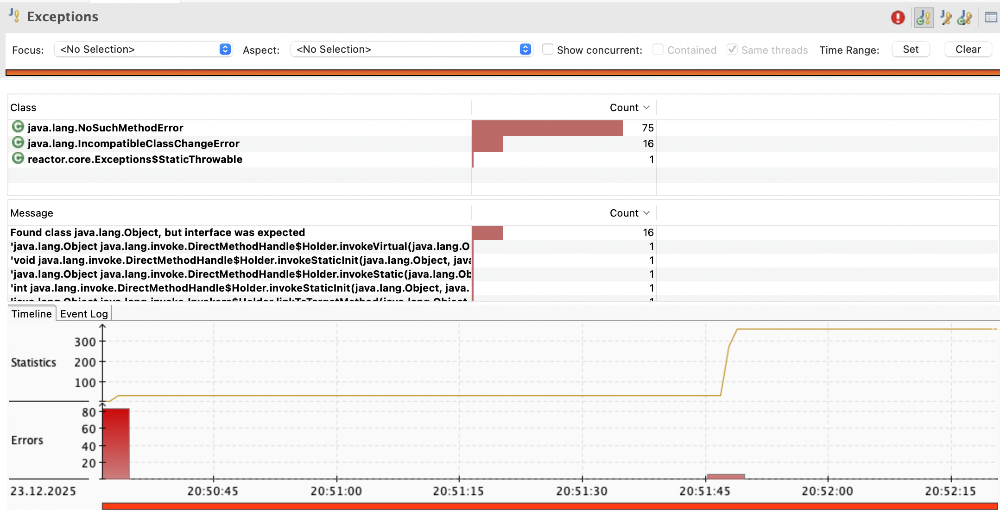
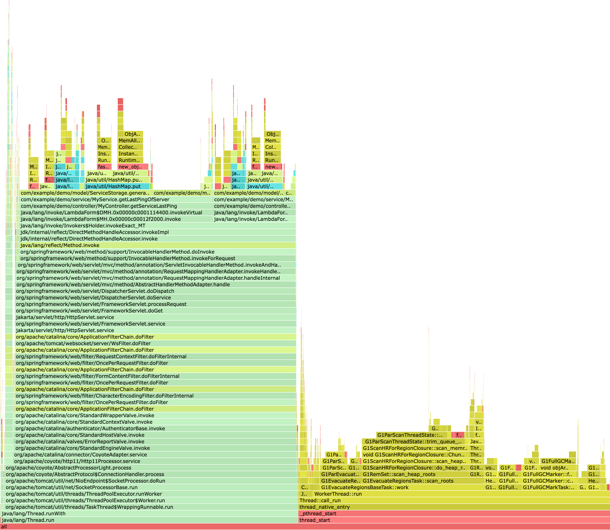
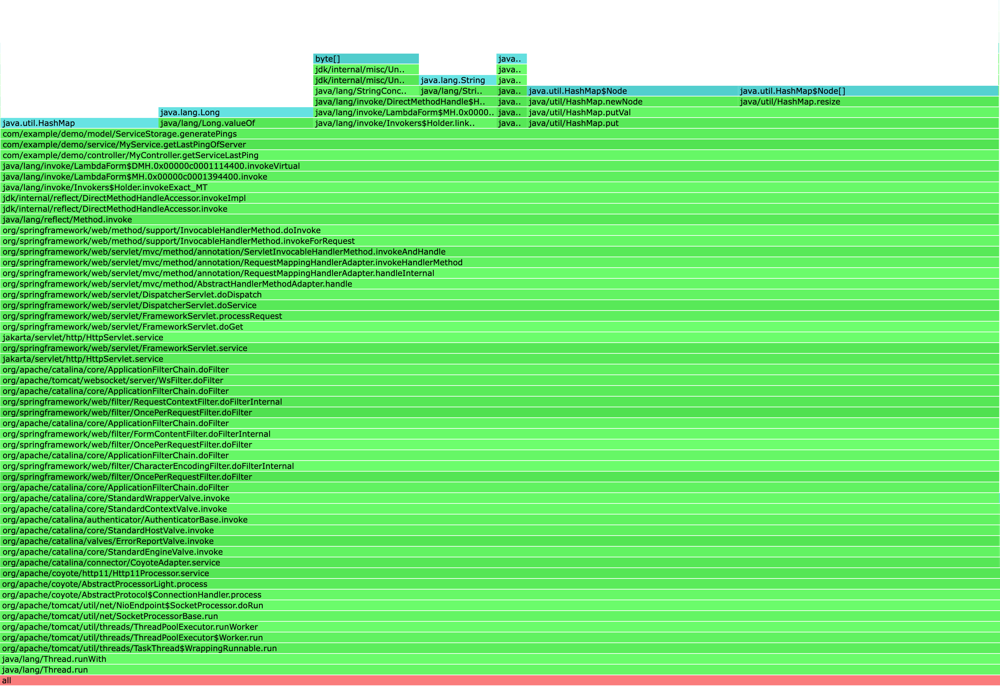

# Лабораторная работа №3

Студент: Круглов Л.А.
Группа: ИУ6-51Б
Вариант: 29

## 1. Цель работы
Выявить узкие места в сервисе B (ЛР2), измерить производительность,
память, CPU, latency и оптимизировать реализацию.

## 2. Описание сервиса
**Сервис А**: Отправляет запросы на получение статуса сервиса / группы сервисов

**Сервис B**: Определяет время последнего пинга сервиса

**Неоптимальная логика**: пинги генерируются каждый раз и хранятся ввиде массива словарей

## 3. Профилирование
### JFR + Java Mission Control
Получим файл .jar с помощью команды ./mvnw clean package и запустим профилировщик:
```bash
./mvnw clean package
java -XX:StartFlightRecording=filename=profile.jfr -jar ./target/demo-0.0.1-SNAPSHOT.jar
```

Сделаем запрос `http://localhost:8082/api/report?service=test`.
Остановим сервер и получим готовый файл `profile.jfr` (сохранён в `/results/profile.jfr`)

Установим Java Mission Control и откроем там `profile.jfr`:



Получим различные метрики:

#### CPU Hot methods



#### Allocations



#### Garbage Collector



#### Threads



#### Exceptions



### Async Profiler

#### CPU



#### Allocation



## Результаты до оптимизации

|Метрика|Значение|
|--|--|
|CPU usage|43%|
|Total allocation|1.4 ГБ|
|Latency|5c|
|GC pause time|30 мс|

## Оптимизации

Заменим хранение пинга в виде массива словарей на массив объектов.

Использую профилировщик, получим новый JFR файл и получим из него метрики (`/results/profile_after.jfr`)

## Результаты после оптимизации

|Метрика|Значение|
|--|--|
|CPU usage|50%|
|Total allocation|407 МБ|
|Latency|1.11c|
|GC pause time|30 мс|

## Выводы 

Узким местом до оптимизации было неправильное хранение пинга в виде словаря, что требовало больше памяти. Использование обычных объектов с теми же полями (по типам) улучшило использование памяти (кучи)